# CSST 星系团搜寻验证阶段参赛报告草稿

## 1. 当前完成范围

本报告先总结目前已经完成的 **cluster / proto-cluster 验证链**，用于对照团队比赛评分标准中的后半部分：过密度候选体构建、可信度排序、与真实星系团表交叉匹配、误证率/完备度/可视化分析。

当前已经完成并可作为参赛材料的部分包括：

- 基于 7band 星系样本构建测光红移星表；
- 使用 cross-hemisphere LSTM 进行 photo-z 预测，即 Hemisphere A 训练预测 Hemisphere B，Hemisphere B 训练预测 Hemisphere A；
- 将 photo-z 星表分成 5 个真实数据覆盖视场；
- 在各 field 内运行 blind search v1.1，得到过密度候选体；
- 对候选体与真实星系团表进行 cross-match；
- 扫描 `i` band 截断、`n_members`、PPM 输出参数等阈值，分析 recovery / purity / false-detection trade-off；
- 对高纯度候选体和各 field 的候选体三维分布进行可视化。

需要明确的是：本报告目前主要覆盖 **cluster 验证工作**。评分标准中关于“仿真1级星表”和“仿真加噪星表”两套输入的最终并行对比、以及严格意义上的“过密度值 accuracy”标定，后续还需要在同一套验证框架上继续补全。

## 2. 与评分标准的对应关系

| 评分项 | 当前完成情况 | 本报告对应内容 |
|---|---|---|
| 星系过密度值的计算方法及程序规范性 | 已完成 blind search v1.1 候选体提取，包含红移切片、二维峰值、候选体合并和成员数估计 | 第 5 节 |
| 星系过密度可信度的计算方法及程序规范性 | 已用 `significance`、`n_members`、PPM richness、PPM z_rms 等作为可信度指标并做阈值扫描 | 第 6、9 节 |
| 测光红移准确率 | 已完成完整 7band cross-hemisphere LSTM photo-z 指标 | 第 4 节 |
| 候选体准确率 | 以 purity proxy 作为当前候选体准确率代理 | 第 8、9 节 |
| 候选体误证率 | false-detection proxy = `1 - purity proxy` | 第 8、9 节 |
| 候选体完备度 | completeness / recovery = matched true clusters / covered true clusters | 第 8、9 节 |
| 星系团过密度分布可视化分析 | 已完成 coverage、threshold scan、3D candidate distribution、volume density map | 第 10 节 |
| 代码运行效率及未来可用性 | v1.1 blind search 已优化为按红移排序和 `searchsorted` 窗口扫描；流程脚本化保存 | 第 11 节 |

## 3. 数据与真实星系团定义

### 3.1 真实星系团表

真实星系团表使用：

`/Users/dengcanze/Documents/CSST/SMG_trace_ov_code/data/galaxy_clusters.fits`

当前理解的 true cluster 定义为：基于仿真给出的中心星系与卫星星系标记，对每个中心星系，在 `1.5 Mpc` 以及红移速度差 `2500 km/s` 以内寻找卫星星系，计算 `richness = n_sat + 1`、`sigma_v`、`total_mass` 等物理量，最后选择 `richness >= 10` 或 `total_mass > 10^11.5` 的结构作为真实星系团。

### 3.2 数据覆盖区域

早期直接使用凸包会把 field01、field03 这类不规则覆盖区外的真实星系团也计入分母，导致 covered true clusters 偏多。最终采用更保守的 tight coverage 定义：

- 在 RA-Dec 平面建立 `0.025 deg` 网格；
- 每个网格 cell 至少有 `3` 个 full 7band 星系才视为有效覆盖；
- 对有效 cell 膨胀 `1` 个 cell，避免过度裁掉边缘；
- 所有 `i` band cut 和 `n_members` threshold 均使用同一 field-level true-cluster 分母。

| field | full7band galaxies | convex covered true clusters | tight covered true clusters | removed fraction |
|---:|---:|---:|---:|---:|
| 01 | 383,964 | 1,051 | 668 | 36.44% |
| 02 | 787,461 | 1,124 | 939 | 16.46% |
| 03 | 396,902 | 962 | 546 | 43.24% |
| 04 | 1,227,448 | 1,479 | 1,377 | 6.90% |
| 05 | 1,037,046 | 1,199 | 1,148 | 4.25% |

| field | tight area deg² | convex area deg² | tight/convex |
|---:|---:|---:|---:|
| 01 | 4.687 | 7.747 | 0.61 |
| 02 | 6.593 | 8.033 | 0.82 |
| 03 | 3.850 | 7.151 | 0.54 |
| 04 | 9.034 | 9.809 | 0.92 |
| 05 | 8.467 | 8.862 | 0.96 |

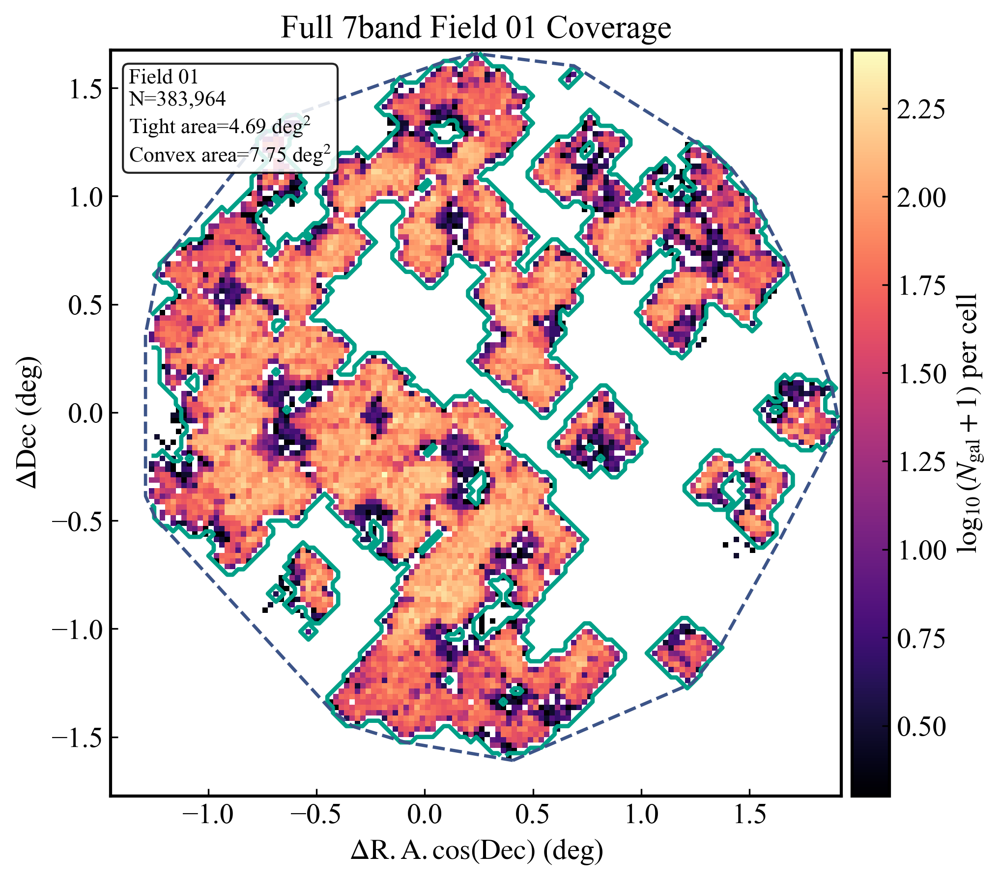

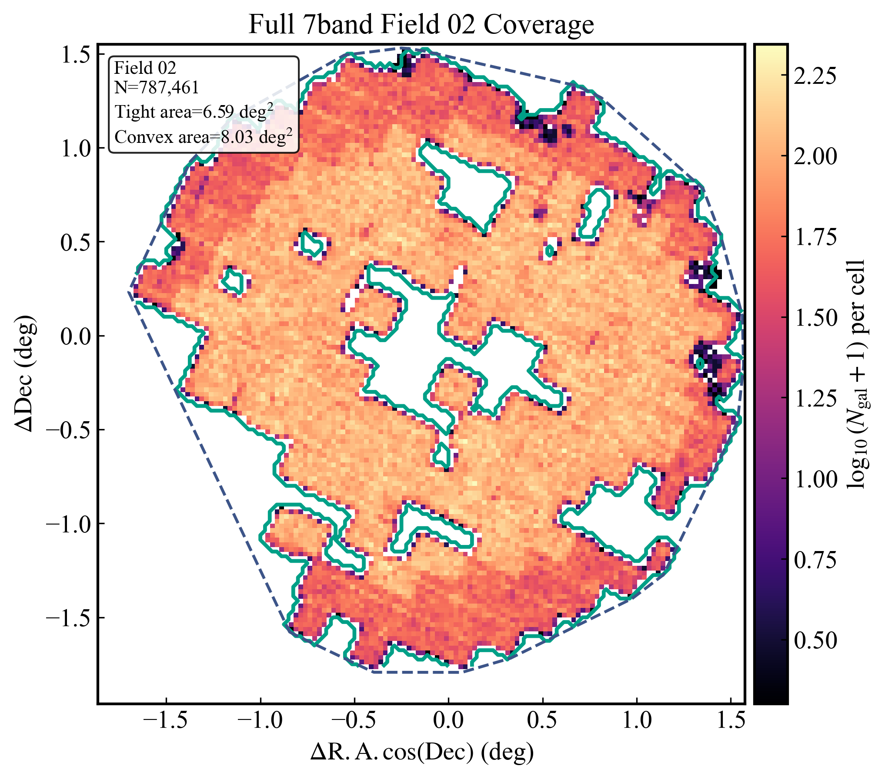

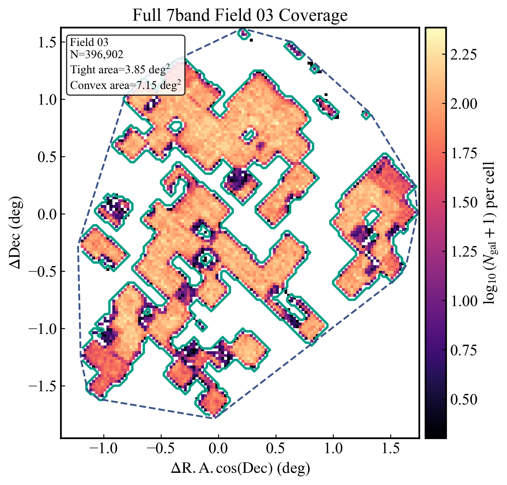

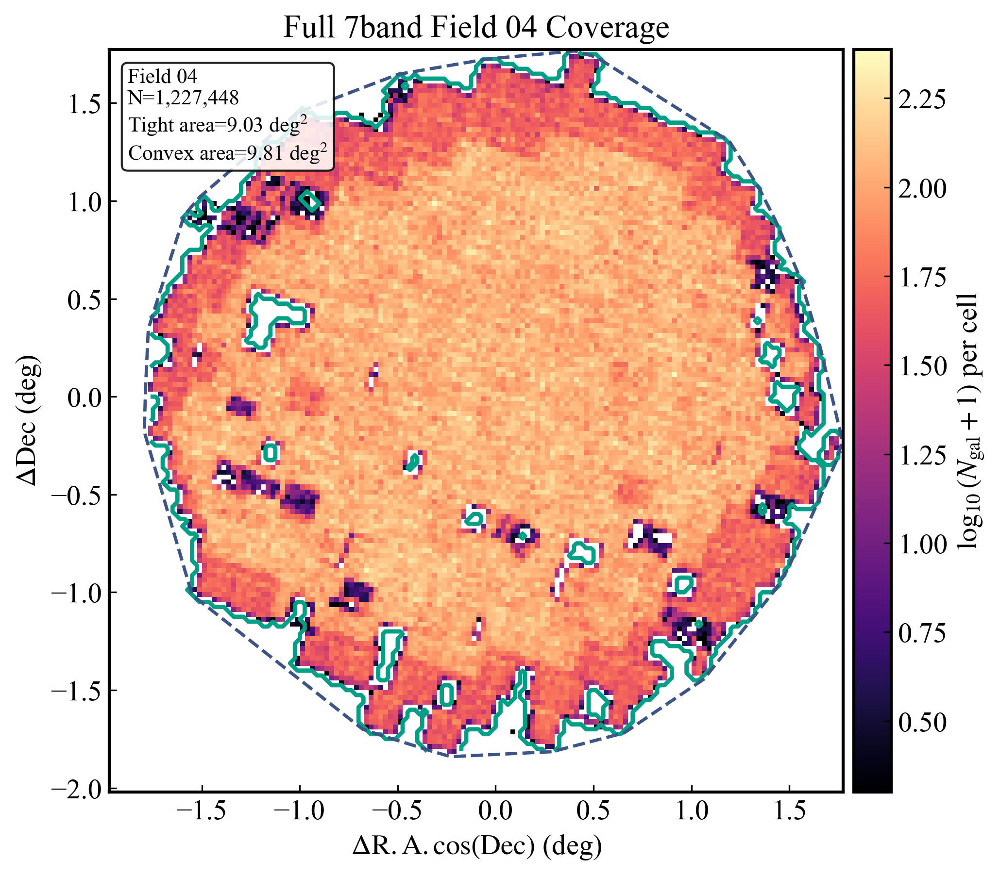

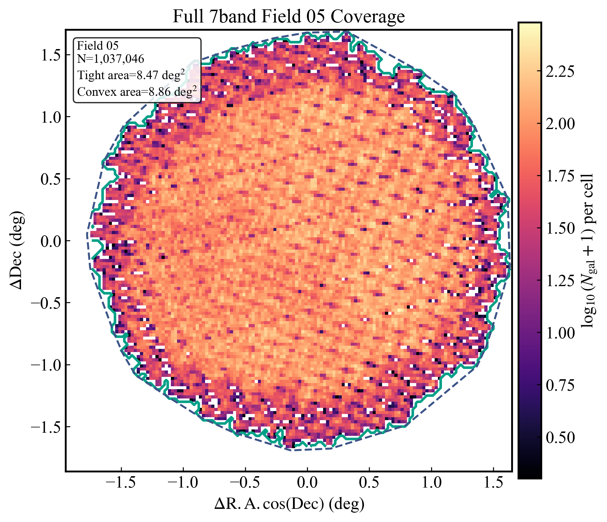

## 4. 测光红移星表与 LSTM photo-z 结果

完整 7band 样本使用 cross-hemisphere LSTM 训练策略：

- Hemisphere A 训练，预测 Hemisphere B；
- Hemisphere B 训练，预测 Hemisphere A；
- 两个 cross-target 预测拼接为最终测光红移星表；
- `zfinal` 写入后续 blind search 输入 FITS；
- `zpdf_l68/u68` 由 MC dropout 的 `z_mc_std` 给出，若无有效 scatter 则使用 `0.03*(1+zfinal)` fallback。

关键输出目录：

`/Users/dengcanze/Documents/CSST/Codex/result/lstm_cross_hemisphere_photoz`

### 4.1 Photo-z 精度

下表采用完整 7band cross-hemisphere 结果。后续 `i<22` 是在 blind search 阶段对星系样本做亮度截断，不应与这里的完整 7band photo-z 精度混用。

| direction | sample role | N | sigma_NMAD | outlier fraction | bias |
|---|---|---:|---:|---:|---:|
| train A predict B | internal holdout | 1,004,157 | 0.0358 | 4.23% | -0.0049 |
| train A predict B | cross target | 1,824,507 | 0.0499 | 6.37% | -0.0016 |
| train B predict A | internal holdout | 912,254 | 0.0393 | 5.89% | -0.0001 |
| train B predict A | cross target | 2,008,314 | 0.0511 | 5.20% | 0.0009 |

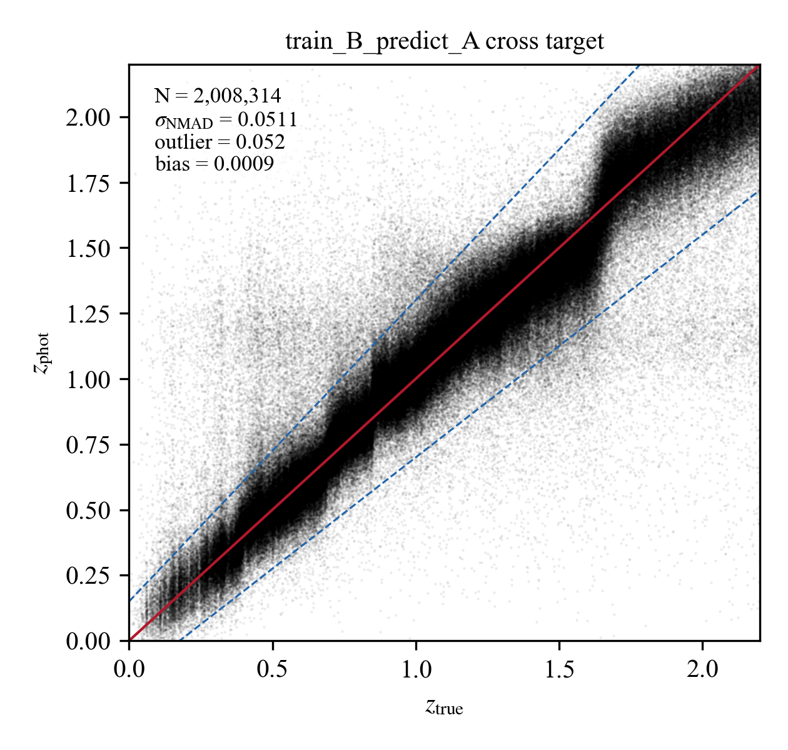

### 4.2 五个 field 的 `i<22` bright-subsample photo-z 输入星表

| field | half | rows | hull area deg² | bbox area deg² | z_phot median | mag_i median |
|---:|---|---:|---:|---:|---:|---:|
| 1 | hemisphere_A | 104,654 | 7.440 | 10.079 | 0.764 | 21.137 |
| 2 | hemisphere_B | 221,290 | 7.734 | 10.467 | 0.723 | 21.121 |
| 3 | hemisphere_A | 107,024 | 6.863 | 9.680 | 0.785 | 21.155 |
| 4 | hemisphere_A | 351,289 | 9.453 | 12.415 | 0.757 | 21.128 |
| 5 | hemisphere_B | 303,443 | 8.523 | 11.098 | 0.741 | 21.040 |

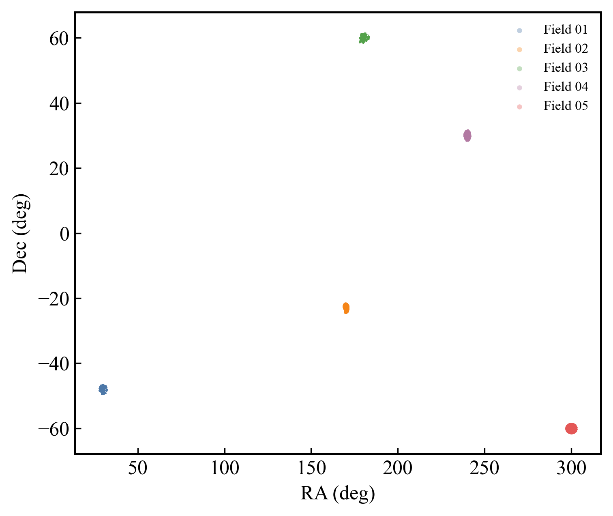

## 5. Blind Search 过密度候选体搜索方法

当前使用 `ppm_blindsearch_ppm_pipeline_v1_1.py` 的 no-PPM blind-search 流程作为主候选体生成器。核心思想如下：

1. 在红移方向建立切片：`z = 0.0 - 2.2`，步长 `0.01`，切片半宽随红移近似按 `0.03*(1+z)` 增长；
2. 对每个红移切片，选出落入该切片的星系；
3. 在 RA-Dec 平面估计二维局部数密度并寻找峰值；
4. 每个峰值记录中心坐标、峰值红移、局部过密度强度、`significance` 和近邻成员数；
5. 使用 greedy NMS 合并相邻红移切片或相近天区内重复出现的峰；
6. 输出候选体 catalog，并以 `n_members`、`significance`、PPM 后验参数作为候选体可信度排序指标。

程序效率方面，blind search 的主要瓶颈已经做过优化：

- 先按 redshift 排序；
- 每个红移切片用 `searchsorted` 取窗口，避免对全表反复布尔筛选；
- 每 20 个切片打印进度，便于长任务监控。

## 6. 可信度指标定义

当前使用三类可信度指标：

| 指标 | 含义 | 用途 |
|---|---|---|
| `significance` | blind search 输出的峰值显著性 | 初筛和排序 |
| `n_members` | 候选体红移切片/局部窗口内关联星系数 | 主阈值扫描指标 |
| PPM 输出参数 | 包括 `PPM_significance`、`PPM_richness`、`PPM_z_rms`、`PPM_rmax_mean` 等 | 后验筛选和诊断 |

目前验证表明，`n_members` 对 purity 的提升最稳定；PPM 参数可以进一步小幅提升 purity，但在保持高 recovery 的情况下提升有限。

## 7. Cross-match 验证方法

候选体与真实星系团的匹配采用：

- 投影物理距离：`d_proj <= 1.5 pMpc/h`；
- 红移差：`|z_peak - z_cluster| <= 0.05*(1+z_cluster)`；
- 统计规则：一对多匹配。只要 candidate 与 true cluster 满足空间和红移条件，就保留为有效 pair。

指标定义：

| 指标 | 定义 | 对应评分项 |
|---|---|---|
| match rate / recovery / completeness | matched true clusters / covered true clusters | 完备度 |
| purity proxy | participating candidates / total candidates | 候选体准确率代理 |
| false-detection proxy | 1 - purity proxy | 误证率代理 |
| candidate density | total candidates / covered true clusters | 候选体数量膨胀程度 |

说明：这里的 purity proxy 是候选体层面的参与匹配比例，即至少匹配到一个 true cluster 的 candidate 数占所有 candidate 的比例。由于采用一对多匹配，matched true clusters 与 matched candidates 不必相等。

## 8. 五个 field 的主要验证结果

### 8.1 不加 `n_members` 强筛的基础 i-band cut 结果

在仅改变 `i` band 截断、不额外用高 `n_members` 筛选时，recovery 很高，但候选体数量也很大，purity proxy 通常只有约 20-30%。

| field | best baseline i cut | covered true clusters | candidates | matched true clusters | match rate | purity proxy | candidate density |
|---:|---|---:|---:|---:|---:|---:|---:|
| 01 | i<21.5 | 668 | 5,952 | 608 | 91.02% | 26.24% | 8.91 |
| 02 | i<21.5 | 939 | 8,753 | 882 | 93.93% | 27.01% | 9.32 |
| 03 | i<21.5 | 546 | 5,582 | 503 | 92.12% | 26.48% | 10.22 |
| 04 | i<21.5 | 1,377 | 11,542 | 1,295 | 94.05% | 28.50% | 8.38 |
| 05 | i<21.5 | 1,148 | 16,381 | 1,124 | 97.91% | 21.81% | 14.27 |

### 8.2 F1 折中条件

定义 `F1 = 2 * recovery * purity / (recovery + purity)`，用于寻找 recovery 和 purity 的折中点。

| field | best F1 condition | candidates kept | matched true clusters | recovery | purity proxy | F1 |
|---:|---|---:|---:|---:|---:|---:|
| 01 | i<21.5, n_members>=10 | 2,174 | 452 | 67.66% | 38.36% | 0.490 |
| 02 | i<21.5, n_members>=10 | 3,700 | 687 | 73.16% | 40.27% | 0.519 |
| 03 | i<22.0, n_members>=15 | 2,243 | 396 | 72.53% | 35.71% | 0.479 |
| 04 | i<21.5, n_members>=10 | 4,657 | 1,056 | 76.69% | 45.20% | 0.569 |
| 05 | i<22.0, n_members>=7 | 4,590 | 949 | 82.67% | 40.63% | 0.545 |

整体上，`i<22` 附近加低到中等 `n_members` 阈值可以维持较高 recovery，同时将 purity proxy 从约 20-30% 提高到约 35-45%。

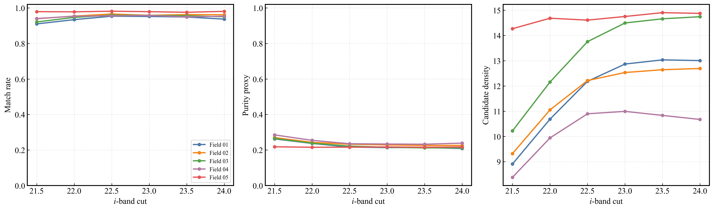

### 8.3 `i<22` 下的 `n_members` 阈值行为

`n_members` 阈值升高时，candidate 数量快速下降，purity proxy 上升，recovery 下降。这给出了一个清晰的可调工作点：

| field | n_members >= | candidates | matched true clusters | recovery | purity proxy | candidate density |
|---:|---:|---:|---:|---:|---:|---:|
| 01 | 7 | 3,828 | 545 | 81.59% | 32.68% | 5.73 |
| 02 | 7 | 6,218 | 811 | 86.37% | 33.32% | 6.62 |
| 03 | 7 | 3,687 | 452 | 82.78% | 31.57% | 6.75 |
| 04 | 7 | 8,159 | 1,229 | 89.25% | 36.29% | 5.93 |
| 05 | 7 | 4,590 | 949 | 82.67% | 40.63% | 4.00 |

## 9. 高纯度候选体与 PPM 后验筛选

### 9.1 每个 field 保留至少 50 个 candidates 的高纯度阈值

对 field01-04，选择“仍能保留至少 50 个 candidates 的最高 `n_members` 阈值”。field05 使用达到 purity proxy >= 90% 的阈值。

| field | n_members >= | candidates | matched candidates | unmatched candidates | matched true clusters | recovery | purity proxy |
|---:|---:|---:|---:|---:|---:|---:|---:|
| 01 | 110 | 50 | 37 | 13 | 42 | 6.29% | 74.00% |
| 02 | 163 | 50 | 42 | 8 | 50 | 5.32% | 84.00% |
| 03 | 91 | 51 | 33 | 18 | 39 | 7.14% | 64.71% |
| 04 | 168 | 52 | 47 | 5 | 80 | 5.81% | 90.38% |
| 05 | 67 | 72 | 65 | 7 | 约 91 | 7.93% | 90.28% |

高纯度阈值适合用于“最可靠候选体源表”，但牺牲了大量 completeness。若比赛最终更重视候选体 catalog 的可靠性，可以将其作为保守版本；若更重视 completeness，则应使用第 8.2 节的 F1 折中版本。

### 9.2 Field05 PPM 输出参数扫描

PPM 二次筛选以 Field05 `i<22 + n_members>=7` 为 baseline。该批 PPM 扫描沿用当时的 covered true clusters 分母 `1188`，与最终 tight coverage 主表的 Field05 分母 `1148` 略有差异；因此这里主要用于说明 PPM 后验指标对 purity/recovery 的相对趋势。

Baseline：

- candidates：4,590；
- matched true clusters：956；
- recovery：80.47%；
- purity proxy：40.78%；
- F1：0.541。

在 recovery >= 80% 的要求下，PPM 参数扫描未找到优于 baseline 的阈值；在 recovery 约 70% 时，最佳 purity proxy 提高到约 43.4%；在 recovery 约 50% 时，purity proxy 可提高到约 47.9%。

| cut | candidates | matched true clusters | recovery | purity proxy | F1 |
|---|---:|---:|---:|---:|---:|
| baseline: i<22+n_members>=7 | 4,590 | 956 | 80.47% | 40.78% | 0.541 |
| PPM_significance>=2.269 & PPM_richness>=7 | 3,574 | 834 | 70.20% | 43.37% | 0.536 |
| PPM_significance>=2.6151 & PPM_richness>=18 | 1,983 | 604 | 50.84% | 47.86% | 0.493 |

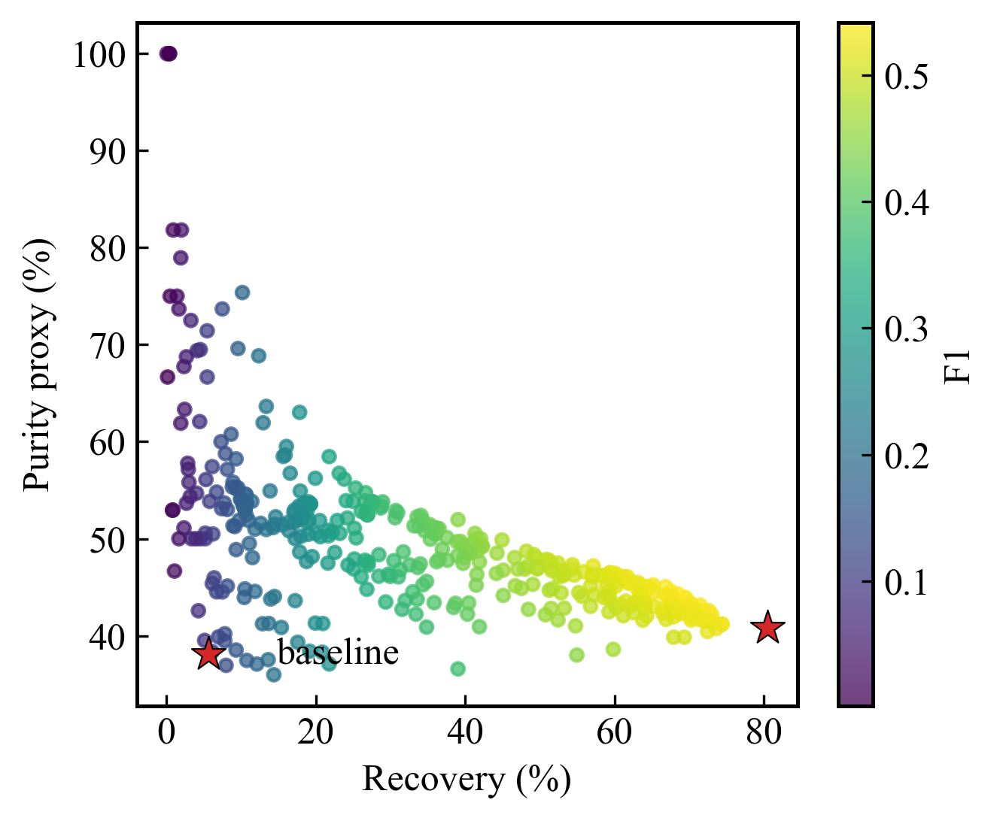

结论：PPM 参数更适合作为候选体后验诊断与排序特征；若目标是在保持高 recovery 的同时大幅提升 purity，需要进一步引入颜色、星等、stellar mass 或局部密度形态特征做监督式 reranker。

## 10. 可视化分析

### 10.1 Field05 高纯度候选体三维分布

该图展示 Field05 中达到 purity proxy >= 90% 的 candidates。红色为未匹配候选体，蓝色为匹配候选体；红移方向已经转换为共动距离。

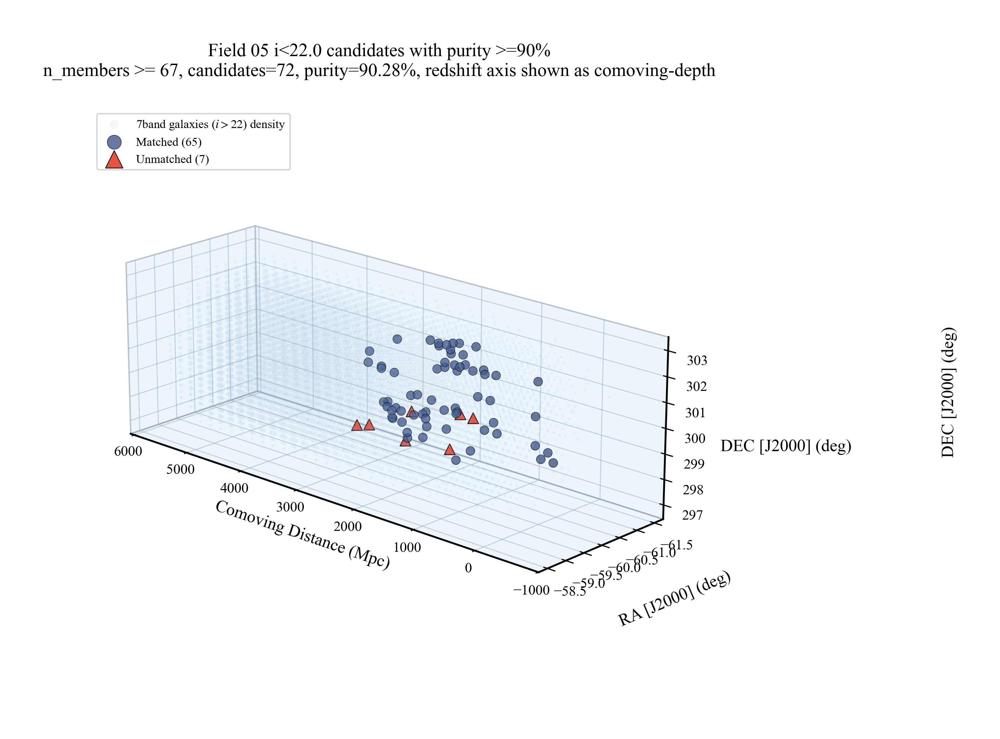

### 10.2 Field05 体密度图

背景为 full 7band Field05 全体星系的三维密度云，候选体叠加其上。该图用于展示候选体在大尺度结构中的空间位置。

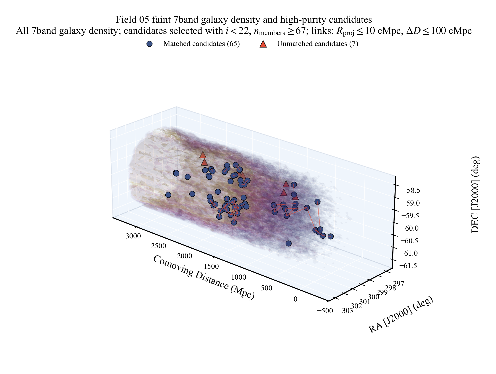

### 10.3 Field01-04 至少 50 个 candidates 的高纯度分布

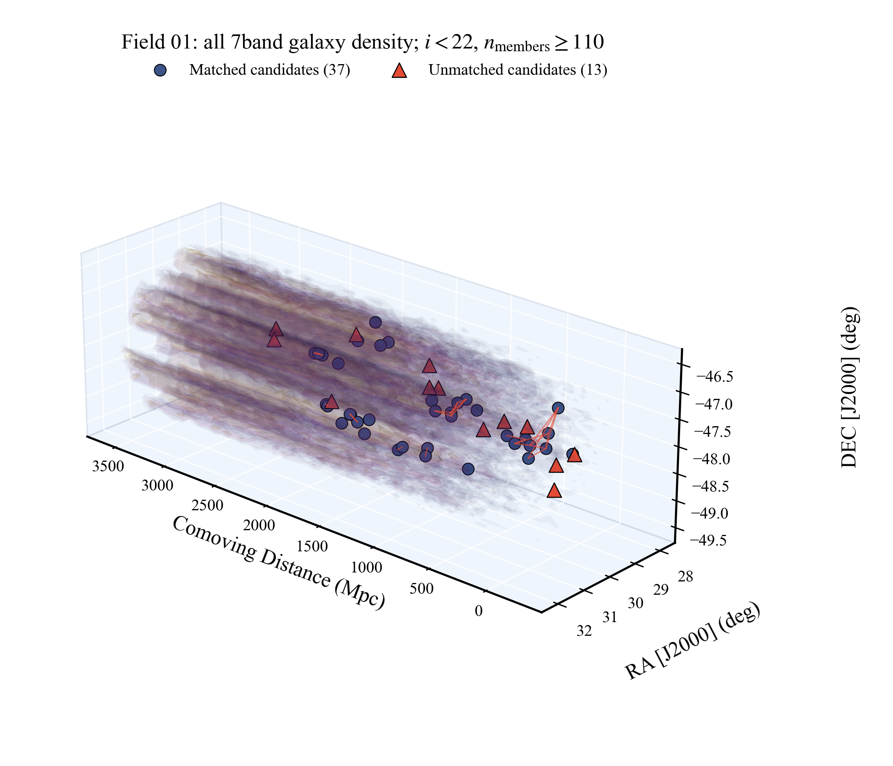

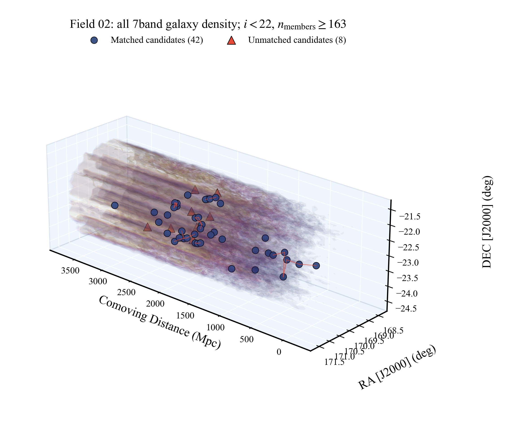

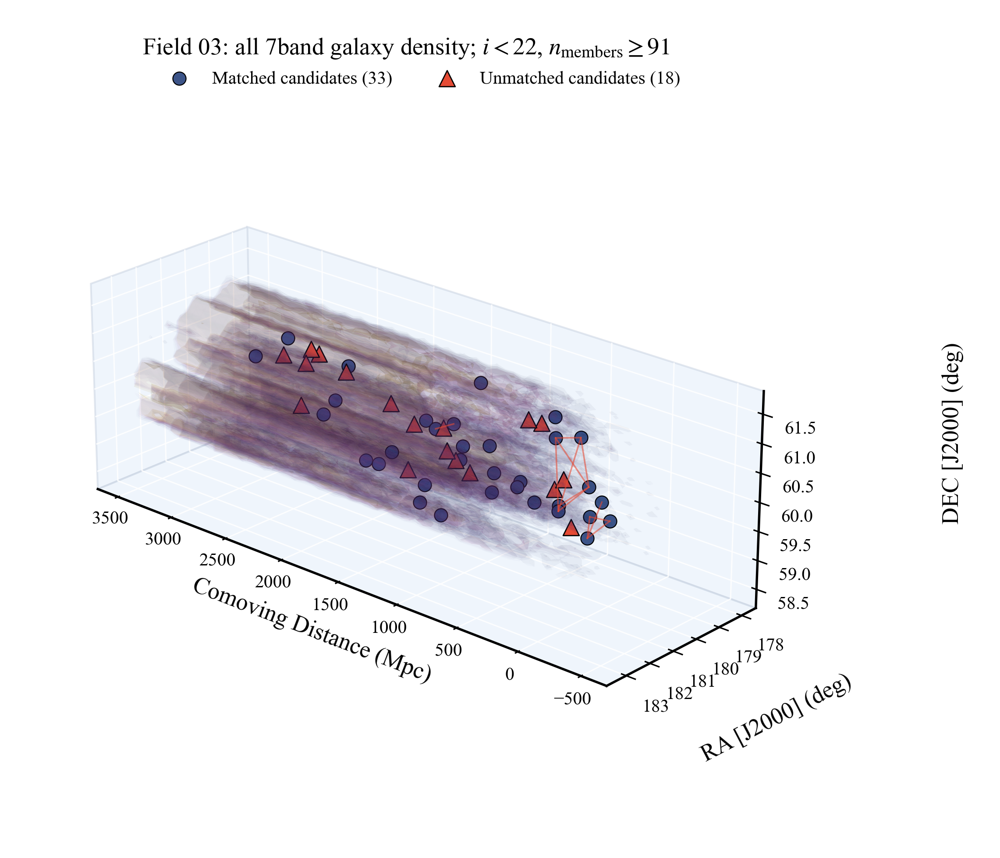

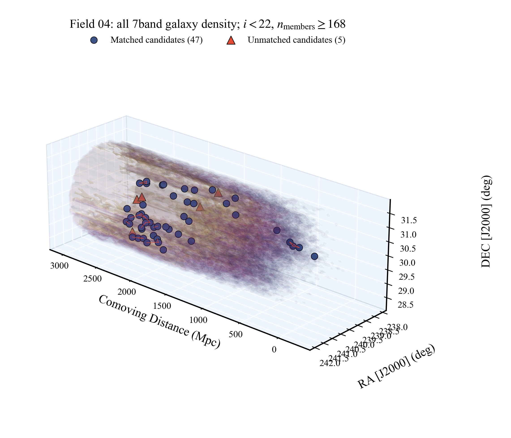

## 11. 程序与可复用性

当前验证链中主要脚本包括：

| 功能 | 脚本 |
|---|---|
| Cross-hemisphere LSTM photo-z | `/Users/dengcanze/Documents/CSST/Codex/code/run_lstm_cross_hemisphere_photoz.py` |
| 构建 7band field 输入与分布图 | `/Users/dengcanze/Documents/CSST/Codex/code/build_full7band_cross_lstm_field_inputs_and_plots.py` |
| Blind search v1.1 主流程 | `/Users/dengcanze/Documents/CSST/Codex/code/ppm_blindsearch_ppm_pipeline_v1_1.py` |
| Cross-match 验证 | `/Users/dengcanze/Documents/CSST/Codex/code/validate_field_crossmatch.py` |
| field01-04 i-cut blind search grid | `/Users/dengcanze/Documents/CSST/Codex/code/run_full7band_field01_04_i_cut_blindsearch_grid.py` |
| PPM 参数阈值扫描 | `/Users/dengcanze/Documents/CSST/Codex/code/scan_field05_i22_ppm_thresholds.py` |
| 高纯度三维候选体图 | `/Users/dengcanze/Documents/CSST/Codex/code/plot_field05_i22_purity90_volume_density.py` |
| field01-04 min50 体密度图 | `/Users/dengcanze/Documents/CSST/Codex/code/plot_fields01_04_i22_min50_volume_density.py` |

代码层面已经形成较完整的模块化结构：输入 catalog、field 覆盖、blind search、cross-match、阈值扫描、可视化均可单独复用。后续若接入仿真1级星表和仿真加噪星表，只需要替换输入 photo-z catalog，并复用同一套 field coverage、blind search 和 cross-match 评估脚本。

## 12. 阶段性结论

1. Cross-hemisphere LSTM photo-z 在完整 7band cross-target 上达到 `sigma_NMAD ~ 0.050-0.051` 的跨半球泛化精度，outlier fraction 约 `5.2-6.4%`，可作为 cluster blind search 的 photo-z 输入。
2. 直接用 blind search v1.1 搜索时，五个 field 的 true cluster recovery 普遍可达到 `90%` 以上，但候选体数量较多，purity proxy 只有约 `20-30%`。
3. 使用 `n_members` 阈值后，候选体数量显著下降，purity proxy 可提升到约 `35-45%`，同时保留 `67-83%` 左右的 recovery，是当前较稳健的主工作点。
4. 极高纯度版本可以通过很高的 `n_members` 阈值获得，例如 Field04 和 Field05 可以达到约 `90%` purity proxy，但 recovery 降到约 `5-8%`，更适合作为“高置信候选体子样本”。
5. PPM 后验参数可以小幅提升 purity，但目前不能在高 recovery 条件下显著超过 `n_members` baseline；未来应将 PPM 参数与星等、颜色、stellar mass、局部密度形态一起作为 reranker 特征。
6. tight coverage 修正非常关键。对 field01 和 field03，不规则覆盖导致凸包方法会额外引入 `36-43%` 的覆盖外 true clusters；修正后 recovery 评估更合理。

## 13. 下一步建议

为了完整覆盖比赛评分标准，建议下一阶段补全：

1. 将同一套流程分别用于“仿真1级星表”和“仿真加噪星表”，形成两套最终 candidate catalog；
2. 对候选体的过密度值本身做真实 overdensity 或 true cluster richness 的定量标定，补上“过密度 accuracy”；
3. 将 PPM、`n_members`、`significance`、photo-z uncertainty、星等/颜色/stellar mass 等特征合并，训练一个候选体 reranker；
4. 在最终参赛表中同时提供“高完备度版本”和“高纯度版本”，分别对应不同科学使用场景。
