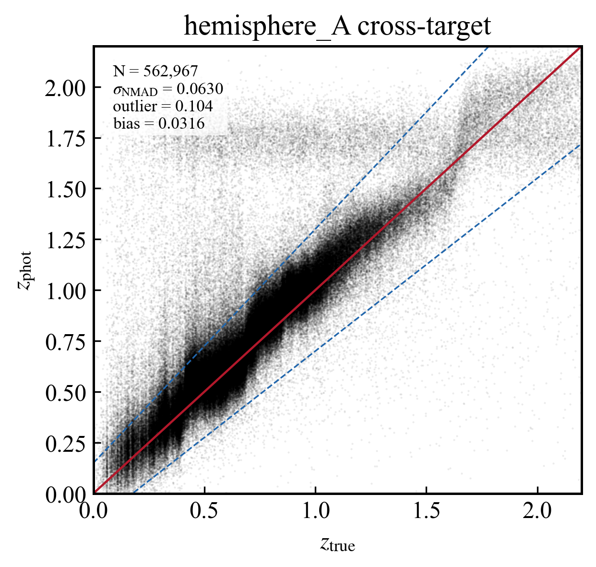
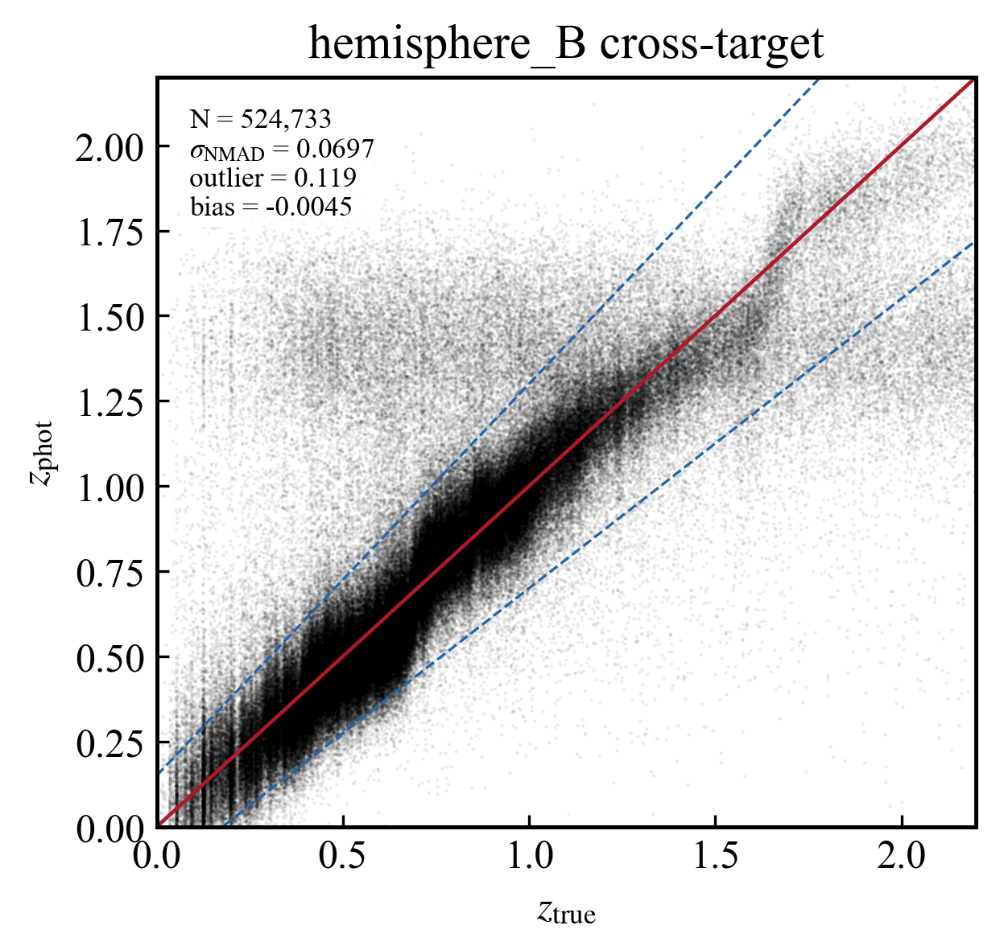
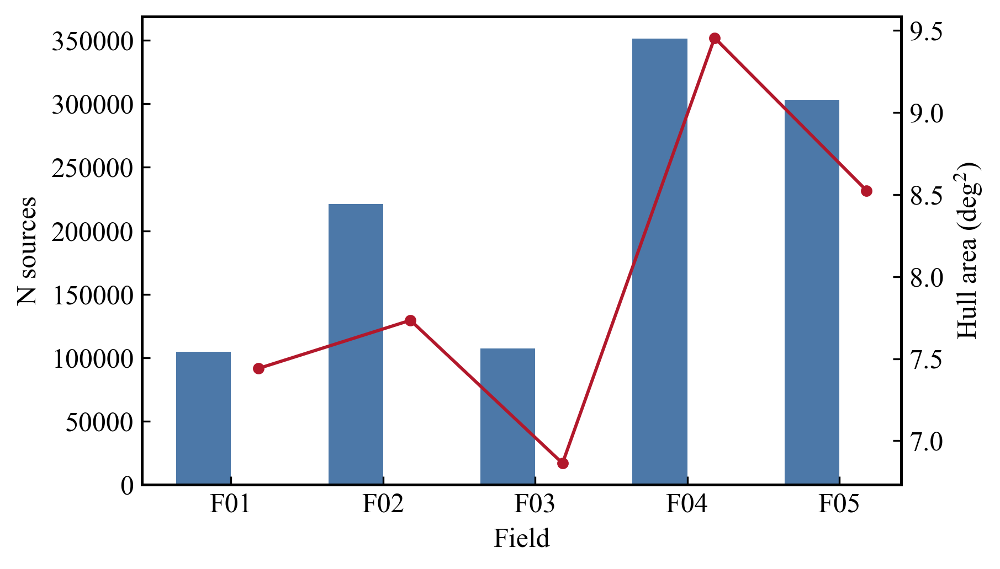

# CSST 7band i<22 Cross-Hemisphere LSTM Photo-z

## 目标

使用 7band 中 `i < 22` 的亮星样本重新做 cross-hemisphere LSTM：

- hemisphere A 训练，预测 hemisphere B；
- hemisphere B 训练，预测 hemisphere A；
- 将 cross-target 预测写成 5 个 field 的最终 blind-search 可用 FITS 星表。

## 输入与输出

- i<22 输入目录：`/Users/dengcanze/Documents/CSST/Codex/result/lstm_cross_hemisphere_photoz_i22/inputs`
- 预测总表：`/Users/dengcanze/Documents/CSST/Codex/result/lstm_cross_hemisphere_photoz_i22/cross_runs_full/cross_hemisphere_lstm_predictions_combined.csv`
- 输出目录：`/Users/dengcanze/Documents/CSST/Codex/result/lstm_cross_hemisphere_photoz_i22/final_5field_catalogs`
- field summary：`/Users/dengcanze/Documents/CSST/Codex/result/lstm_cross_hemisphere_photoz_i22/final_5field_catalogs/csst_7band_i22_cross_lstm_5field_summary.csv`

## Photo-z 指标

| direction | sample_role | N | sigma_NMAD | outlier_fraction | bias |
|---|---|---:|---:|---:|---:|
| train_A_predict_B | internal_holdout | 281,484 | 0.048689 | 0.065677 | 0.001924 |
| train_A_predict_B | cross_target | 524,733 | 0.069651 | 0.119447 | -0.004514 |
| train_B_predict_A | internal_holdout | 262,366 | 0.056770 | 0.106001 | -0.002454 |
| train_B_predict_A | cross_target | 562,967 | 0.062982 | 0.104104 | 0.031551 |

## 半球 photo-z vs z_true

## 五个 field 最终星表

| field | half | rows | hull_area_deg2 | bbox_area_deg2 | z_phot_median | mag_i_median | FITS |
|---:|---|---:|---:|---:|---:|---:|---|
| 1 | hemisphere_A | 104,654 | 7.440 | 10.079 | 0.764 | 21.137 | `/Users/dengcanze/Documents/CSST/Codex/result/lstm_cross_hemisphere_photoz_i22/final_5field_catalogs/hemisphere_A/csst_field_01_i22_cross_lstm.fits` |
| 2 | hemisphere_B | 221,290 | 7.734 | 10.467 | 0.723 | 21.121 | `/Users/dengcanze/Documents/CSST/Codex/result/lstm_cross_hemisphere_photoz_i22/final_5field_catalogs/hemisphere_B/csst_field_02_i22_cross_lstm.fits` |
| 3 | hemisphere_A | 107,024 | 6.863 | 9.680 | 0.785 | 21.155 | `/Users/dengcanze/Documents/CSST/Codex/result/lstm_cross_hemisphere_photoz_i22/final_5field_catalogs/hemisphere_A/csst_field_03_i22_cross_lstm.fits` |
| 4 | hemisphere_A | 351,289 | 9.453 | 12.415 | 0.757 | 21.128 | `/Users/dengcanze/Documents/CSST/Codex/result/lstm_cross_hemisphere_photoz_i22/final_5field_catalogs/hemisphere_A/csst_field_04_i22_cross_lstm.fits` |
| 5 | hemisphere_B | 303,443 | 8.523 | 11.098 | 0.741 | 21.040 | `/Users/dengcanze/Documents/CSST/Codex/result/lstm_cross_hemisphere_photoz_i22/final_5field_catalogs/hemisphere_B/csst_field_05_i22_cross_lstm.fits` |

## 五场数据分布图

## 说明

- `zfinal` 为本轮 `i<22` cross-hemisphere LSTM 的 `z_phot`。
- `zpdf_l68/u68` 由 MC dropout 的 `z_mc_std` 给出；若无有效 scatter，则使用 `0.03*(1+zfinal)` fallback。
- 面积为当前 `i<22` 选中源在各 field 内的 RA-Dec 凸包面积；同时给出 cos(dec) 修正后的 bbox 面积供参考。
- 这轮没有运行 EAZY-py，因此输出 FITS 不包含新的 EAZY stellar mass。
