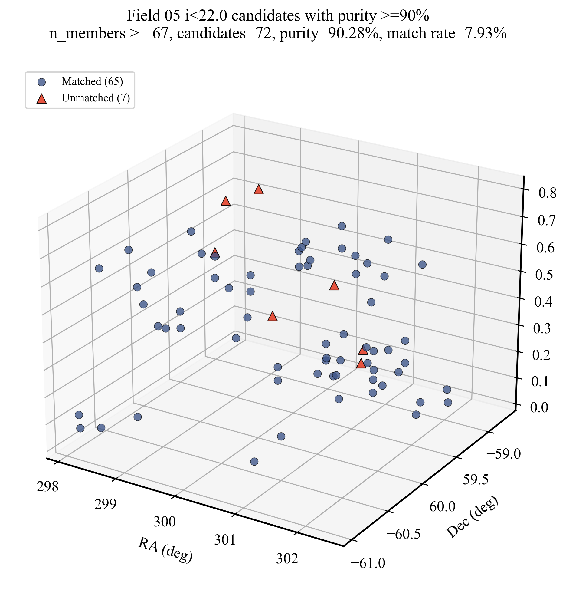

# Field 05 i<22.0 Purity >=90% Candidate 3D Distribution

- Candidate table: `/Users/dengcanze/Documents/CSST/Codex/result/version_1_1_noppm_field05_7band_i_lt_22p0/blind_search/COSMOS_Web_PPM_Candidates_v1_0.csv`
- Match table: `/Users/dengcanze/Documents/CSST/Codex/result/full7band_i_cut_grid_crossmatch_all_fields_r1p5_tightcoverage/field05_i_lt_22p0/field05_crossmatch_matches.csv`
- Selected threshold: `n_members >= 67`
- Candidates kept: `72`
- Matched candidates: `65`
- Unmatched candidates: `7`
- Purity proxy: `90.28%`
- Match rate: `7.93%`
- Output candidate CSV: `/Users/dengcanze/Documents/CSST/Codex/result/full7band_i_cut_grid_crossmatch_all_fields_r1p5_tightcoverage/field05_i22_purity90_candidates_3d/field05_i22_purity90_candidates.csv`

## Comoving-distance depth-axis version

- The redshift axis is converted to comoving distance using `FlatLambdaCDM(H0=70, Om0=0.3)`.
- Axis aspect is set to `RA : comoving distance : Dec = 1 : 3 : 1`, i.e. the redshift/depth axis is three times longer.
- A faint blue density layer shows full 7band Field 05 galaxies with `mag_i > 22`, binned in 3D and drawn behind the candidates.

